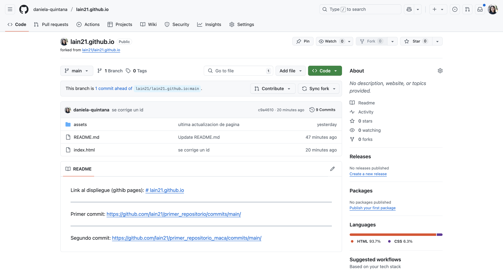
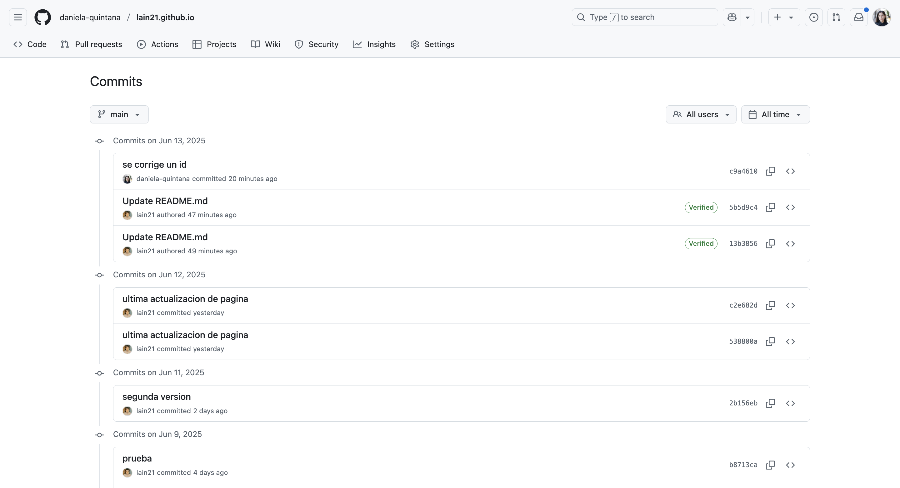
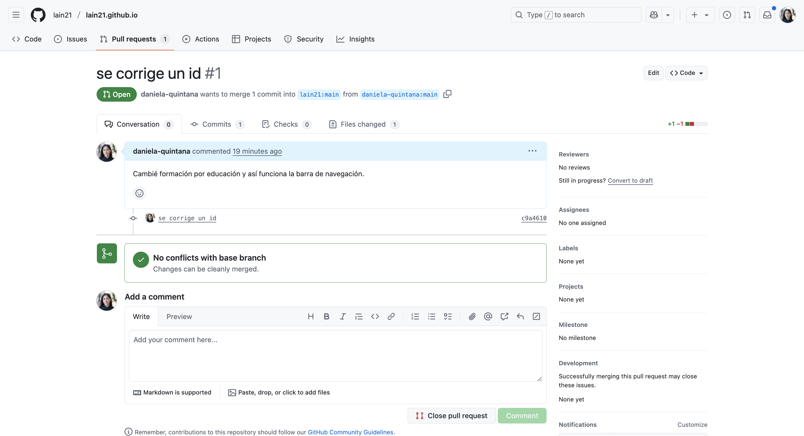
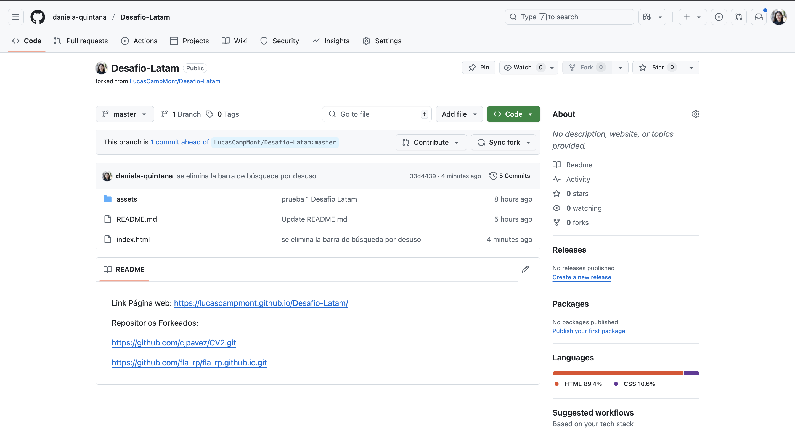
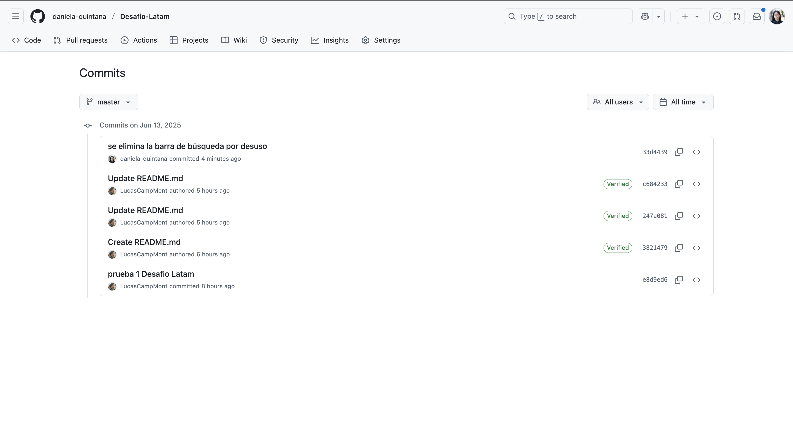
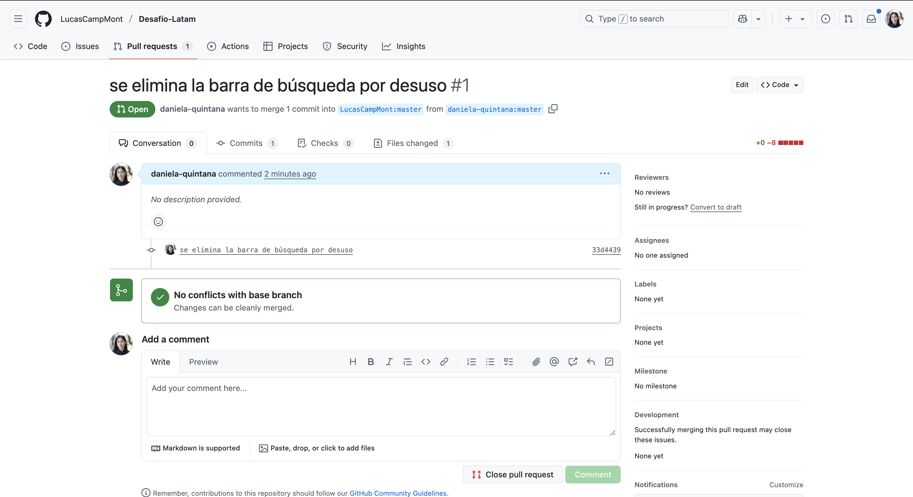

# 📄 CV Web - Daniela Quintana

### 🚀 El sitio está desplegado en GitHub Pages:

🔗 https://daniela-quintana.github.io

---

## 📁 Estructura del proyecto

```bash
📦 
├── index.html                  # Página principal del CV
├── portfolio.html              # Página de portafolio
├── contact.html                # Página de contacto
├── assets/
│   ├── css/
│   │   └── styles.css          # Estilos personalizados
│   ├── images/
│   │   └── ....jpg             # Imágenes del proyecto
│   └── resume/
│       └── CV Daniela Quintana 2025.pdf
```

---

## 🔁 Proyectos forkeados

Durante este desafío forkeé y contribuí a los siguientes proyectos de compañeros/as:

1. 🔗 **Fork 1**

      [Fork al portafolio de Abraham Muñoz](https://github.com/daniela-quintana/lain21.github.io)

      

      [Commit](https://github.com/daniela-quintana/lain21.github.io/commits/main/)

      

      [Pull Resquest](https://github.com/lain21/lain21.github.io/pull/1)

      


      Comentario: Cambié el id de formación por educación corrigiendo un error en la barra de navegación.

3. 🔗 **Fork 2**

      [Fork al portafolio de Lucas Campos](https://github.com/daniela-quintana/Desafio-Latam)
   
      

      [Commit](https://github.com/daniela-quintana/Desafio-Latam/commits/master/)
   
      

      [Pull Resquest](https://github.com/LucasCampMont/Desafio-Latam/pull/1)
   
      


      Comentario: Recomendé eliminar barra de búsqueda sin uso

---

## ✅ Rúbrica cumplida

| Requisito                                                                 | Estado |
|---------------------------------------------------------------------------|--------|
| Construye un CV utilizando HTML y CSS                                     | ✅     |
| El CV contiene los 5 elementos solicitados                                | ✅     |
| Construye una página para el portafolio, incluyendo imágenes              | ✅     |
| Despliegue en Github Pages, donde el CV es la página principal            | ✅     |
| Fork a al menos 2 compañeros                                              | ✅     |
| Al menos 1 commit por cada proyecto forkeado                              | ✅     |
